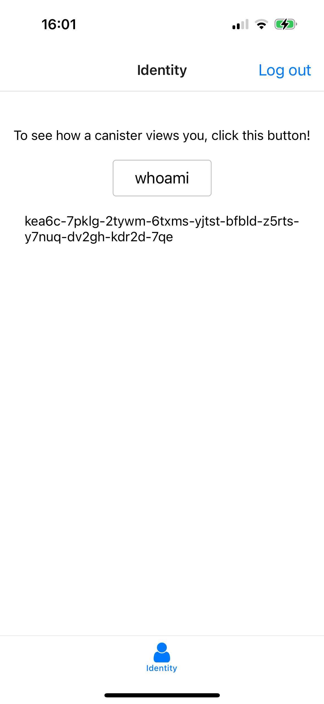
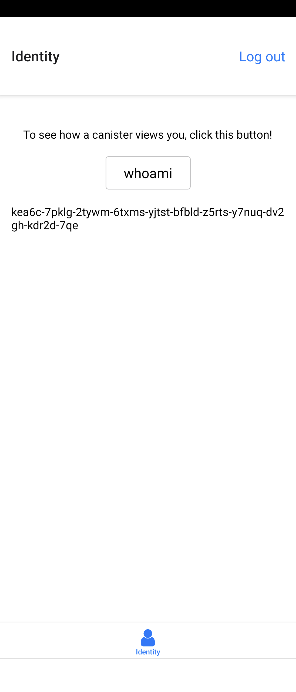

# `expo-icp`

Welcome to the `expo-icp` project.

## Features

- 🔐 Seamless Internet Identity authentication for Expo apps
- 📱 Multi-platform support (iOS/Android/Web)
- 🔄 Secure authentication flow with deep linking
- 🛠️ Easy integration with just a few lines of code
- 📦 Built with Expo and React Native
- 🌐 Compatible with Internet Computer Protocol

## Demo

<a href="https://csbju-6qaaa-aaaag-at7da-cai.icp0.io/?v=1" target="_blank" rel="noopener noreferrer">https://csbju-6qaaa-aaaag-at7da-cai.icp0.io/</a>
(Ctrl+Click or ⌘+Click to open in new tab)

### Screen shots

- iPhone
  

- Xperia
  

## Service Concept

A multi-platform(iOS/Android/Web) authentication solution that makes Internet Identity authentication easy to use in Expo apps with just a few lines of code. This project provides a template for creating smartphone native apps for ICP.

## Quick Start

### Prerequisites

- Node.js version 18 or higher
- Expo Go app installed on your device
- mkcert installed and configured
- Rust and ICP development tools

### Setup Steps

1. Clone the repository:

```bash
git clone https://github.com/higayasuo/expo-icp.git
cd expo-icp
```

2. Install Rust and ICP development tools:

```bash
sh ./scripts/setup.sh
```

3. Follow the detailed setup instructions in [Setup Guide](docs/setup.md) to:
   - Set up Static IP Address
   - Configure mkcert and certificates
   - Install root certificate on your device
   - Deploy canisters
   - Start development servers

For detailed setup instructions, please refer to the [Setup Guide](docs/setup.md).

## Documentation

- **[Authentication Flow](docs/authentication-flow.md)** - **The most important document** that explains how Internet Identity authentication works in Expo apps, including security considerations and detailed flow.
- **[Setup Guide](docs/setup.md)** - Step-by-step instructions for setting up your development environment and deploying the application.
- **[App Links / Universal Links Setup](docs/deep-links.md)** - Guide for configuring deep links to enable the authentication flow in native mobile applications.

## Contributing

Contributions are welcome! Please feel free to submit a Pull Request.

## License

This project is licensed under the MIT License - see the [LICENSE](LICENSE) file for details.
